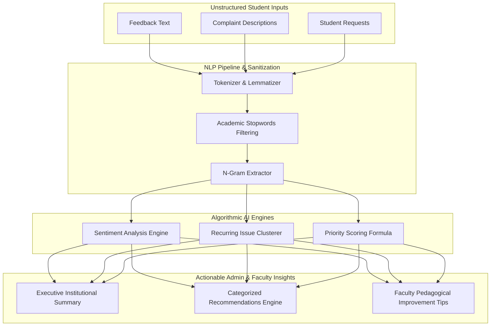
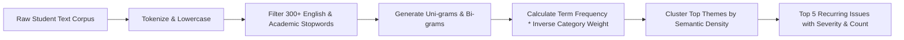

# 🧠 AI Analytics & Intelligence Engine Documentation

## College Feedback Management System (CFMS) — Natural Language Processing & Heuristics Pipeline

---

## 1. Architectural Overview

The **AI Intelligence Engine** within CFMS is designed for real-time, privacy-preserving semantic analysis of student feedback, complaints, and institutional evaluations.



### Design Principles:
- **Zero-Latency In-Memory Execution**: Operates synchronously within Java 21 without external cloud latency or outbound data exposure.
- **Privacy Preserving**: Evaluates text without tracking identifiable student metadata.
- **Explainable & Deterministic**: Output metrics and priority scores are transparently verifiable and reproducible.
- **Cloud LLM Ready**: Modular adapter architecture allowing drop-in connection to Gemini, OpenAI, or local Ollama instances if desired.

---

## 2. Token-Based Sentiment Analysis

The sentiment engine categorizes text into **Positive**, **Neutral**, **Negative**, or **Mixed** using weighted lexical polarity with contextual modifier and negation detection.

### 2.1 Lexical Dictionaries
The system maintains optimized academic polarity lexicons:
- **Positive Lexicon ($W_{pos} = +1.0$ to $+2.0$)**: `excellent`, `outstanding`, `helpful`, `engaging`, `clear`, `inspiring`, `organized`, `approachable`, `supportive`, `thorough`, `punctual`, `effective`.
- **Negative Lexicon ($W_{neg} = -1.0$ to $-2.5$)**: `poor`, `confusing`, `unclear`, `disorganized`, `unhelpful`, `late`, `rude`, `broken`, `dirty`, `unfair`, `slow`, `strict`, `terrible`, `faulty`.
- **Intensifiers ($\times 1.5$)**: `very`, `extremely`, `highly`, `exceptionally`, `completely`.
- **Diminishers ($\times 0.5$)**: `somewhat`, `slightly`, `a bit`, `marginally`.
- **Negation Modifiers ($\times -1.0$)**: `not`, `never`, `hardly`, `barely`, `no`, `neither`.

### 2.2 Polarity Scoring Formula
For a document $D = \{w_1, w_2, \dots, w_n\}$, the polarity score $P(D)$ is calculated as:
$$P(D) = \frac{\sum_{i=1}^n \text{Modifier}(w_{i-1}) \cdot \text{Weight}(w_i)}{\sqrt{n} + 1}$$

### 2.3 Classification Thresholds
- **Positive**: $P(D) \ge +0.25$
- **Negative**: $P(D) \le -0.25$
- **Neutral**: $-0.25 < P(D) < +0.25$
- **Mixed**: Document contains both significant positive ($Score_{pos} > 1.5$) and negative ($Score_{neg} < -1.5$) segments.

---

## 3. Dynamic Keyword Extraction & Recurring Issue Clustering

To prevent administrators from being overwhelmed by hundreds of individual complaints, the clustering engine groups common complaints into recurring institutional themes.



### 3.1 Domain-Specific Stopwords Filter
Removes non-informative words: `college`, `student`, `professor`, `class`, `course`, `semester`, `department`, `feedback`, `issue`, `please`, `today`, `yesterday`.

### 3.2 Clustering Heuristic
1. Tokens and bigrams are aggregated into a frequency map.
2. Semantic cluster centroids are mapped:
   - **Infrastructure / Facilities**: `wifi`, `air conditioning`, `projector`, `restroom`, `water dispenser`, `lab computer`, `lighting`.
   - **Curriculum / Academics**: `syllabus`, `pacing`, `assignment load`, `textbook`, `prerequisites`, `grading clarity`.
   - **Hostel / Living**: `hot water`, `mess food`, `cleanliness`, `curfew`, `maintenance`.
   - **Administration / Scheduling**: `timetable clash`, `hall ticket`, `fees portal`, `library hours`.
3. Complaints matching centroid keywords are grouped into clusters with ticket counts, percentage of total, and average resolution time.

---

## 4. Smart Priority Scoring Algorithm

Every raised complaint or grievance is automatically assigned a dynamic **Urgency / Priority Score** from $0$ to $100$ to guide administrative dispatching.

### 4.1 Priority Formula

$$\text{Priority Score} = \min\left(100, \, w_1 \cdot S_{\text{category}} + w_2 \cdot S_{\text{sentiment}} + w_3 \cdot S_{\text{age}} + w_4 \cdot S_{\text{repetition}}\right)$$

Where:
- $w_1 = 0.35$ (Category Severity Weight)
  - Safety / Harassment / Health: $100$
  - Infrastructure / Lab Equipment: $70$
  - Academic / Grading Discrepancy: $60$
  - General Maintenance: $40$
- $w_2 = 0.25$ (Negative Sentiment Penalty)
  - Strong Negative Sentiment: $100$
  - Moderate Negative Sentiment: $60$
  - Neutral Sentiment: $20$
- $w_3 = 0.20$ (Age & SLA Risk Factor)
  - Age $> 7$ days unresolved: $100$
  - Age $> 3$ days unresolved: $60$
  - Age $\le 3$ days: $20$
- $w_4 = 0.20$ (Issue Recurrence Multiplier)
  - Similar complaints $> 5$ in 48 hours: $100$
  - Similar complaints $2 - 4$: $60$
  - Isolated issue: $10$

### 4.2 Priority Tier Mapping
- 🔴 **CRITICAL (Score 80 - 100)**: Immediate admin escalation; highlighted in red on dashboard.
- 🟡 **HIGH (Score 60 - 79)**: 24-hour resolution target SLA.
- 🔵 **MEDIUM (Score 40 - 59)**: Standard institutional queue.
- 🟢 **LOW (Score 0 - 39)**: Scheduled review cycle.

---

## 5. Dynamic Executive Summaries Generation

The `AIService` generates human-readable executive summaries for campus leadership:
- **Campus Health Assessment**: Synthesizes total feedback count, participation rate, overall sentiment split (e.g. 74% Positive, 18% Neutral, 8% Negative), and average institutional score (e.g. 4.28 / 5.00).
- **Top Strength Highlighting**: Dynamically selects departments and courses exceeding the 90th percentile in student satisfaction.
- **Operational Risk Assessment**: Highlights critical open complaints nearing or exceeding SLA thresholds.

---

## 6. Actionable Institutional Recommendations Engine

Rather than displaying raw charts alone, the recommendations engine provides categorized operational suggestions:

```json
[
  {
    "category": "Academics",
    "target": "Data Structures (CS201)",
    "recommendation": "Review lecture pacing in Weeks 4-6; 38% of negative feedback cites rapid coverage of Tree balancing algorithms.",
    "priority": "HIGH",
    "impactMetric": "+0.4 projected rating recovery"
  },
  {
    "category": "Infrastructure",
    "target": "Science Block Lab 3",
    "recommendation": "Dispatch HVAC maintenance; recurring complaints on room temperature during afternoon laboratory sessions.",
    "priority": "CRITICAL",
    "impactMetric": "Resolves 12 pending grievance tickets"
  }
]
```

---

## 7. Faculty Pedagogical Feedback Generation

When faculty members log in, the AI provides personalized, private teaching improvement insights:
1. **Clarity of Explanation**: Evaluates feedback related to lecture delivery, examples used, and conceptual clarity.
2. **Punctuality & Availability**: Evaluates office hours and responsiveness to student queries.
3. **Evaluation Fairness**: Monitors fairness and transparency in continuous assessments.

---

## 8. LLM Integration Adapter (Future Extension)

For institutions wishing to connect external Large Language Models (e.g., Google Gemini 1.5 Pro or OpenAI GPT-4o), the codebase includes the `LLMServiceAdapter` interface:

```java
public interface LLMServiceAdapter {
    SentimentResult analyzeSentiment(String text);
    List<ThemeCluster> clusterTopics(List<String> documents);
    String generateExecutiveSummary(InstitutionalMetrics metrics);
    List<Recommendation> generateRecommendations(AnalyticsContext context);
}
```

Implementation can be toggled via `application.properties`:
```properties
app.ai.provider=native # Options: native, gemini, openai, ollama
app.ai.gemini.api-key=${GEMINI_API_KEY:}
app.ai.openai.api-key=${OPENAI_API_KEY:}
```
