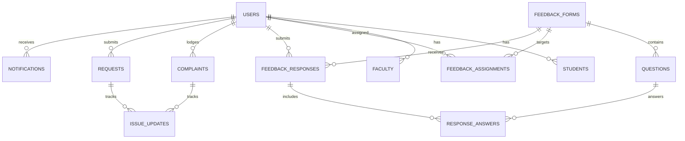

# 🗄️ Database Schema Specification
## College Feedback Management System (CFMS)

---

## 1. Relational Entity Overview

The system uses a normalized relational schema with 13 core tables designed for PostgreSQL 16.

---

## 2. Table Definitions

### 2.1 `users`
| Column | Type | Constraints | Description |
|---|---|---|---|
| `id` | UUID | PRIMARY KEY | User identifier |
| `email` | VARCHAR(255) | UNIQUE, NOT NULL | Login email address |
| `password` | VARCHAR(255) | NOT NULL | BCrypt hashed password |
| `full_name` | VARCHAR(255) | NOT NULL | User's full name |
| `role` | VARCHAR(50) | NOT NULL | Enum: `STUDENT`, `FACULTY`, `ADMIN` |
| `identifier` | VARCHAR(100) | NULL | Roll number or Employee ID |
| `department` | VARCHAR(100) | NULL | Academic department |
| `year_of_study` | INT | NULL | Student year (1–4) |
| `is_active` | BOOLEAN | DEFAULT TRUE | Account activation flag |
| `created_at` | TIMESTAMP | NOT NULL | Record creation timestamp |

### 2.2 `students` & `faculty`
- `students`: Profile extension storing `roll_number`, `batch`, `program`, `department`, `current_semester`.
- `faculty`: Profile extension storing `faculty_id`, `department`, `designation`.

### 2.3 `feedback_forms`
| Column | Type | Constraints | Description |
|---|---|---|---|
| `id` | UUID | PRIMARY KEY | Unique form ID |
| `title` | VARCHAR(255) | NOT NULL | Campaign name |
| `description` | TEXT | NULL | Instructions |
| `category` | VARCHAR(100) | NOT NULL | `COURSE`, `FACULTY`, `INFRASTRUCTURE`, `HOSTEL`, `LIBRARY`, `GENERAL` |
| `target_audience` | VARCHAR(50) | NOT NULL | `STUDENTS`, `FACULTY`, `BOTH` |
| `target_department` | VARCHAR(100) | NULL | Targeted department |
| `status` | VARCHAR(50) | NOT NULL | `DRAFT`, `PUBLISHED`, `CLOSED` |
| `deadline` | TIMESTAMP | NULL | Submission cutoff date |
| `allow_anonymous` | BOOLEAN | DEFAULT TRUE | Anonymity setting |

### 2.4 `questions`
| Column | Type | Constraints | Description |
|---|---|---|---|
| `id` | UUID | PRIMARY KEY | Question ID |
| `form_id` | UUID | FOREIGN KEY (`feedback_forms.id`) | Owning feedback form |
| `question_text` | TEXT | NOT NULL | The survey question |
| `question_type` | VARCHAR(50) | NOT NULL | `RATING`, `TEXT`, `YES_NO`, `MULTIPLE_CHOICE` |
| `options` | TEXT | NULL | JSON array of choices for multiple choice |
| `is_required` | BOOLEAN | DEFAULT TRUE | Mandatory answer flag |
| `display_order` | INT | NOT NULL | Sort order in questionnaire |

### 2.5 `feedback_assignments`
- Links a `user_id` and `form_id` with `status` (`PENDING`, `IN_PROGRESS`, `COMPLETED`, `EXPIRED`) and `assigned_at` / `completed_at`.

### 2.6 `feedback_responses` & `response_answers`
- `feedback_responses`: Stores `form_id`, `user_id` (masked if `is_anonymous = true`), `overall_rating` (1.0–5.0), `is_anonymous`, `submitted_at`.
- `response_answers`: Stores `response_id`, `question_id`, `rating_value` (1–5), `text_answer`.

### 2.7 `complaints`
| Column | Type | Constraints | Description |
|---|---|---|---|
| `id` | UUID | PRIMARY KEY | Complaint ID |
| `ticket_number` | VARCHAR(50) | UNIQUE, NOT NULL | Public tracking code (`CMP-XXX`) |
| `student_id` | UUID | FOREIGN KEY (`users.id`) | Submitting student |
| `category` | VARCHAR(100) | NOT NULL | Issue classification |
| `title` | VARCHAR(255) | NOT NULL | Subject header |
| `description` | TEXT | NOT NULL | Detailed problem description |
| `priority` | VARCHAR(50) | NOT NULL | `LOW`, `MEDIUM`, `HIGH`, `CRITICAL` |
| `status` | VARCHAR(50) | NOT NULL | `PENDING`, `IN_PROGRESS`, `ESCALATED`, `RESOLVED`, `CLOSED` |
| `assigned_cell` | VARCHAR(100) | NULL | Responsible department cell |
| `target_resolution_time` | TIMESTAMP | NULL | SLA resolution deadline |
| `public_visible` | BOOLEAN | DEFAULT FALSE | Public portal eligibility |
| `created_at` | TIMESTAMP | NOT NULL | Lodged date |

### 2.8 `requests`
- Stores student service applications with `request_number` (`REQ-XXX`), `category`, `title`, `description`, `status` (`PENDING`, `IN_PROGRESS`, `APPROVED`, `REJECTED`, `COMPLETED`), and `assigned_cell`.

### 2.9 `issue_updates`
- Immutable lifecycle audit trail storing `issue_type` (`COMPLAINT` / `REQUEST`), `complaint_id` / `request_id`, `updated_by_id`, `status_update`, `comment`, `created_at`.

### 2.10 `notifications`
- In-app notification queue storing `user_id`, `title`, `message`, `type`, `link`, `is_read`, `created_at`.

### 2.11 `ai_insights`
- Persistent AI analytics insights storing `type` (`TREND`, `CATEGORY`, `SENTIMENT`, `SLA_ALERT`), `title`, `description`, `confidence_score`, `created_at`.
