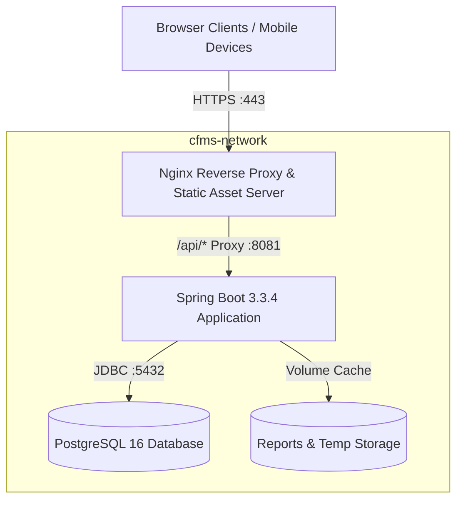

# 🚀 Production Deployment & Operations Guide

## College Feedback Management System (CFMS) — Deployment Manual

---

## 1. System Architecture & Topology

CFMS is architected for containerized, high-availability deployments with low resource overhead.



### Resource Requirements:
| Component | Minimum Spec | Recommended Spec |
|:---|:---|:---|
| **CPU** | 2 vCPUs | 4 vCPUs |
| **RAM** | 2 GB | 4 GB |
| **Storage** | 20 GB SSD | 50 GB NVMe SSD |
| **OS** | Linux (Ubuntu 22.04 LTS / Debian 12 / Alpine) or Windows Server 2022 | Ubuntu 24.04 LTS |

---

## 2. Docker Compose Deployment (Recommended)

Docker Compose provides a single-command deployment including PostgreSQL 16, Spring Boot backend, and Nginx frontend.

### 2.1 Clone Repository & Configure Environment
```bash
# Navigate to project directory
cd "modified new student feedback management system"

# Copy environment template
cp .env.example .env
```

### 2.2 Configure `.env`
Edit `.env` with production secrets:
```properties
# App Environment
SPRING_PROFILES_ACTIVE=postgres
APP_PORT=8080
SERVER_PORT=8081

# PostgreSQL Configuration
DB_HOST=postgres
DB_PORT=5432
DB_NAME=college_feedback_db
DB_USER=feedback_admin
DB_PASSWORD=ChangeThisToAStrongSecretPassword123!

# Security & JWT
JWT_SECRET=c2VjdXJlX2NvbGxlZ2VfZmVlZGJhY2tfbWFuYWdlbWVudF9zeXN0ZW1fa2V5XzIwMjY=
JWT_EXPIRATION_MS=86400000

# CORS Origins (Comma separated)
CORS_ALLOWED_ORIGINS=http://localhost:8080,https://feedback.yourcollege.edu
```

### 2.3 Launch Containerized Stack
```bash
# Build and launch all services in detached mode
docker compose up --build -d

# Verify running containers
docker compose ps

# Inspect logs
docker compose logs -f backend
```

### 2.4 Verify Service Availability
- **Frontend & Public Grievances**: `http://localhost:8080` (or `https://your-domain.edu`)
- **Backend API Base**: `http://localhost:8081/api`
- **Health Endpoint**: `http://localhost:8081/actuator/health`

---

## 3. Local Standalone Development Deployment

For developers running without Docker:

### 3.1 Backend Execution (Java 21 + Embedded H2 / PostgreSQL)
```powershell
# Set Java 21 environment
$env:JAVA_HOME = "C:\Program Files\Java\jdk-21.0.10"
$env:Path = "$env:JAVA_HOME\bin;" + $env:Path

# Navigate to backend
cd backend

# Run with embedded database (zero configuration required)
.\mvnw.cmd spring-boot:run -Dspring-boot.run.profiles=local
```
The backend will boot on `http://localhost:8081/api` and auto-seed initial administrative and demo accounts.

### 3.2 Frontend Execution
Serve the root directory using any HTTP server:
```powershell
# Using Python 3 HTTP Server
python -m http.server 8080

# Or using Node.js npx serve
npx serve -l 8080 .
```
Access the application at `http://localhost:8080`.

---

## 4. Default Demonstration & Administrative Credentials

On first run, the database is auto-populated with demo accounts:

| Role | Username | Password | Purpose |
|:---|:---|:---|:---|
| **Administrator** | `admin` | `admin123` | Institutional management, report generation, form builder, AI analytics |
| **Faculty Member** | `faculty1` | `faculty123` | Department faculty view, ratings dashboard, pedagogical AI feedback |
| **Student** | `student1` | `student123` | Assigned feedback evaluation, raising complaints, tracking tickets |

> [!CAUTION]
> **Production Mandatory**: Immediately change all default administrator and faculty passwords upon initial deployment.

---

## 5. Nginx Production SSL/TLS Reverse Proxy Configuration

For production HTTPS termination, place this configuration in `/etc/nginx/sites-available/feedback.conf`:

```nginx
server {
    listen 80;
    server_name feedback.yourcollege.edu;
    return 301 https://$host$request_uri;
}

server {
    listen 443 ssl http2;
    server_name feedback.yourcollege.edu;

    ssl_certificate /etc/letsencrypt/live/feedback.yourcollege.edu/fullchain.pem;
    ssl_certificate_key /etc/letsencrypt/live/feedback.yourcollege.edu/privkey.pem;
    ssl_protocols TLSv1.2 TLSv1.3;
    ssl_ciphers HIGH:!aNULL:!MD5;

    # Static Frontend Assets
    root /var/www/cfms-frontend;
    index index.html;

    location / {
        try_files $uri $uri/ /index.html;
    }

    # API Proxy to Spring Boot Backend
    location /api/ {
        proxy_pass http://127.0.0.1:8081/api/;
        proxy_set_header Host $host;
        proxy_set_header X-Real-IP $remote_addr;
        proxy_set_header X-Forwarded-For $proxy_add_x_forwarded_for;
        proxy_set_header X-Forwarded-Proto https;
        proxy_read_timeout 90;
    }
}
```

---

## 6. Database Backup & Disaster Recovery

### 6.1 Automated Daily PostgreSQL Backup
Create backup cron script `/usr/local/bin/cfms-backup.sh`:
```bash
#!/bin/bash
BACKUP_DIR="/var/backups/cfms"
TIMESTAMP=$(date +"%Y%m%d_%H%M%S")
mkdir -p $BACKUP_DIR

docker exec cfms_postgres pg_dump -U feedback_admin -F c college_feedback_db > "$BACKUP_DIR/cfms_db_$TIMESTAMP.dump"

# Retain backups for 30 days
find $BACKUP_DIR -type f -name "cfms_db_*.dump" -mtime +30 -delete
```
Schedule via crontab:
```cron
0 2 * * * /usr/local/bin/cfms-backup.sh > /dev/null 2>&1
```

### 6.2 Restoration Procedure
```bash
docker exec -i cfms_postgres pg_restore -U feedback_admin -d college_feedback_db --clean < /var/backups/cfms/cfms_db_20260910.dump
```

---

## 7. Troubleshooting & Diagnostic Runbook

| Issue Symptom | Root Cause | Solution |
|:---|:---|:---|
| `Port 8081 already in use` | Another service is using port 8081 | Modify `SERVER_PORT` in `.env` or terminate conflicting process: `netstat -ano \| findstr :8081` |
| `PSQLException: Connection refused` | PostgreSQL container is still initializing or down | Check DB logs: `docker compose logs postgres`. Ensure `DB_HOST=postgres` in `.env` |
| `CORS Error: No 'Access-Control-Allow-Origin'` | Frontend host not listed in allowed origins | Add frontend domain to `CORS_ALLOWED_ORIGINS` in `.env` and restart backend |
| `JWT signature does not match` | Secret key changed or corrupted | Ensure all instances share identical `JWT_SECRET` |
| `Reports fail with OutOfMemoryError` | Low JVM heap limit during large Excel generation | Add JVM options: `-Xms512m -Xmx2048m` in `JAVA_OPTS` |
