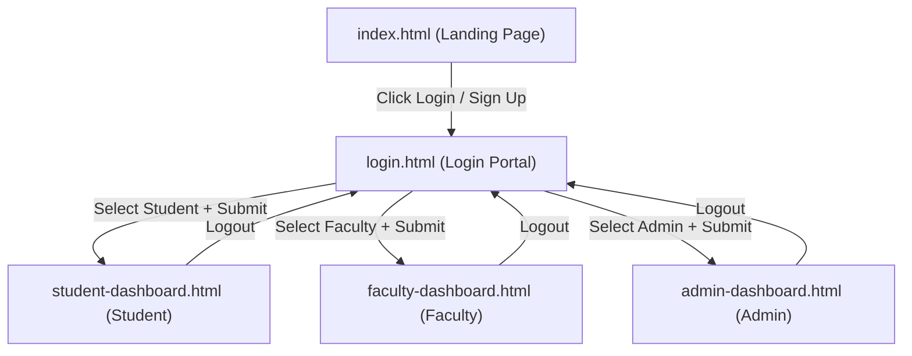
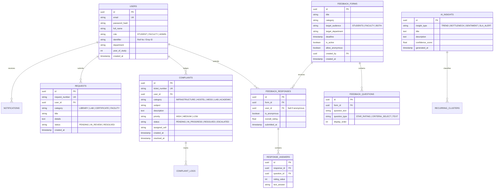
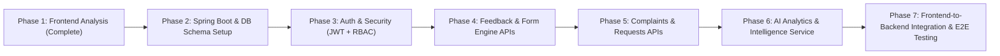

# 📋 Comprehensive Project Analysis & Backend Integration Blueprint
## College Student Feedback Management System

---

## 1. Executive Summary

This document provides a thorough structural analysis of the existing frontend architecture for the **College Feedback Management System**, detailing existing UI pages, components, data flows, routing mechanics, mock states, and the comprehensive **Spring Boot + PostgreSQL + JWT + AI Service** backend integration blueprint for upcoming phases.

---

## 2. Current Frontend Stack & Architecture

| Layer | Technology / Tool | Details |
|---|---|---|
| **Markup & Semantics** | HTML5 | Semantic structure with accessible attributes (`aria-label`, `<header>`, `<aside>`, `<main>`, `<footer>`, `<section>`). |
| **Styling & Design Tokens** | CSS3 (Modern Vanilla) | CSS Custom Properties (CSS variables), CSS Grid, Flexbox, multi-level box shadows (`--shadow-sm` through `--shadow-xl`), custom border-radius system, responsive layout containers. |
| **Typography** | Google Fonts | `Plus Jakarta Sans` (headings & brand), `Inter` (data tables, form inputs, body text). |
| **Visualization & Charts** | Chart.js 4.4.1 (Canvas) | Dynamic line charts, vertical bar charts, horizontal priority bars, donut charts with custom tooltip styling and responsive canvas containers. |
| **Client-side Interactivity** | Vanilla JavaScript (ES6+) | Role switching selector, password visibility toggles, modal dialog management (`openModal`, `closeModal`), custom star rating component, dynamic chart filtering, toast notification alert engine. |
| **Icons & Media** | Inline SVGs | Lightweight, scalable vector icons styled using currentColor. |
| **Local Runtime** | Python HTTP / Node / Any static server | Zero build-step requirement, instant reload and testing on `http://localhost:8080`. |

---

## 3. Existing Folder & File Structure

```
c:\Users\sharu\Downloads\modified new student feedback management system\
│
├── index.html                   # Page 1: Public Landing Page
├── login.html                   # Page 2: Role-Switching Authentication Portal
├── student-dashboard.html       # Page 3: Student Feedback, Grievance & Tracking Portal
├── faculty-dashboard.html       # Page 4: Faculty Evaluation, Ratings & Teaching Insights
├── admin-dashboard.html         # Page 5: Admin Command Center & AI Analytics Suite
│
├── css/
│   └── styles.css               # Master Design System (tokens, variables, typography, modals, cards)
│
├── js/
│   └── app.js                   # Application logic (role switcher, modal manager, toasts, star ratings)
│
├── assets/                      # Vector assets and institutional media
├── README.md                    # Project overview & navigation matrix
└── PROJECT_ANALYSIS.md          # Complete project analysis & backend blueprint (this file)
```

---

## 4. Existing Pages & Component Inventory

### Page 1 — Landing Page (`index.html`)
* **Top Navbar**: Logo emblem, brand title, anchor links (`Home`, `About`, `How It Works`, `Features`), `Login` & `Sign Up` CTA buttons.
* **Hero Section**:
  * Heading: *"Make Your Voice Heard"*
  * Subtitle: *"Your feedback helps us improve our college. Share feedback, report issues, and track improvements."*
  * CTAs: Primary *"Give Feedback"* (routes to `login.html`), Secondary *"Learn More"*.
  * Interactive SaaS preview card with live feed metrics, SLA resolution badges, and floating metric pills.
  * Trust verification bar (Confidentiality, Verified Roles, Direct Tracking).
* **How It Works (4 Horizontal Step Cards)**:
  1. `01 Give Feedback` — Structured feedback questionnaires.
  2. `02 Identify Issues` — AI analytics categorization & bottleneck detection.
  3. `03 Take Action` — Departmental task allocation and grievance redressal.
  4. `04 See Improvement` — Measurable semester progress and facility upgrades.
* **Platform Features (6 Feature Cards)**:
  1. *Feedback* (Course, faculty, and institutional evaluations)
  2. *Complaints* (Priority-based grievance lodging)
  3. *Requests* (Library, lab, and administrative service requests)
  4. *Track Issues* (Real-time timeline progress)
  5. *Privacy* (Role-based access & double-blind anonymity)
  6. *Improvements* (AI sentiment analytics & self-improvement loops)
* **Bottom CTA Banner**: *"Your Feedback → Better Decisions → Better Campus"* with *"Get Started"* button.
* **Global Footer**: Links for About Us, Contact, Privacy Policy, Terms, Help, and Copyright notice.

---

### Page 2 — Login Page (`login.html`)
* **Layout**: Centered authentication card with background radial backdrop.
* **Header**: College Feedback System logo badge, *"Welcome Back"*, and *"Login to access your account"*.
* **Interactive 3-Role Selection Cards**:
  1. 👨‍🎓 **STUDENT** *(Default active with highlighted blue border & background)*
  2. 👨‍🏫 **FACULTY**
  3. 👨‍💼 **ADMIN**
* **Form Inputs**:
  * Email / User ID (auto-updates placeholder and preset email based on selected role)
  * Password input with show/hide password toggle eye icon
  * "Remember me" checkbox & "Forgot Password?" toast trigger
  * Primary "Login" button with role-based routing
  * Active Role confirmation indicator pill
  * "Don't have an account? Sign Up" trigger link.

---

### Page 3 — Student Dashboard (`student-dashboard.html`)
* **Left Sidebar**:
  * 🏠 Dashboard *(Active)*
  * 📝 Assigned Feedback *(Badge: 3)*
  * ⚠ Complaints *(Badge: 2)*
  * 📩 Requests *(Badge: 1)*
  * 🔎 Track Status
  * 👤 Profile & 🚪 Logout
  * Student Profile Footer: Aarav Sharma (CS-2024-042).
  * *(Strict Constraint Checked: No "Create Feedback" option exists for students)*.
* **Top Header**: Welcome banner + Quick action buttons (`+ Raise Complaint`, `+ New Request`).
* **KPI Summary Cards (4 Cards)**:
  1. Assigned Feedback: `3 Pending`
  2. Complaints: `2 Active`
  3. Requests: `1 Pending`
  4. Track Status: `View Updates`
* **Pending Feedback Cards**:
  1. *Data Science – Faculty Feedback* (Assigned by Faculty: Dr. Vikram Malhotra | Deadline: 15 Sept 2026)
  2. *Infrastructure Feedback* (Assigned by Admin: Campus Facilities Cell | Deadline: 18 Sept 2026)
  3. *Elective Course Review: AI & Machine Learning* (Assigned by Faculty: Dept. Academic Board | Deadline: 22 Sept 2026)
* **Recent Complaints & Requests Table**:
  * `#102` | Complaint | Infrastructure | Lab 3 AC & Projector | 🟡 In Progress
  * `#204` | Request | Library | IEEE Xplore access | 🟢 Resolved
  * `#105` | Complaint | Hostel Wi-Fi | Block B weak signal | 🟡 Under Review
* **Interactive Modals**:
  * *Respond to Feedback Modal* (5-star rating widget, criteria dropdown, comment textarea, anonymity toggle).
  * *Raise Complaint Modal* (Category, title, urgency level, description).
  * *Raise Request Modal* (Category, title, justification).

---

### Page 4 — Faculty Dashboard (`faculty-dashboard.html`)
* **Left Sidebar**:
  * 🏠 Dashboard *(Active)*
  * 📝 Assigned Feedback *(Badge: 2)*
  * ⭐ My Ratings *(Badge: 4.4 ★)*
  * 📊 Insights
  * 💡 Improvement Tips *(Badge: AI)*
  * 📈 My Performance
  * 🔔 Notifications *(Badge: 4)*, 👤 Profile, ⚙ Settings, 🚪 Logout
  * Faculty Profile Footer: Dr. Vikram Malhotra (Associate Professor, CS).
  * *(Strict Constraint Checked: Complaints and Requests are completely excluded from Faculty sidebar)*.
* **Top Header**: Welcome banner + `Export Summary` action button.
* **KPI Summary Cards (4 Cards)**:
  1. Assigned Feedback: `2 Pending`
  2. My Ratings: `4.4 / 5` (`▲ +0.3 vs Last Semester`)
  3. Insights: `View Trends` (`82% Student Response Rate`)
  4. My Performance: `View Progress` (`96% Syllabus Milestones Met`)
* **Main Section — Feedback Assigned by Admin**:
  1. *Faculty Development Feedback* (Assigned by: Dean Academic Affairs | Deadline: 15 Sept 2026)
  2. *Teaching & Academic Feedback* (Assigned by: Quality Assurance Cell | Deadline: 20 Sept 2026)
* **Performance Scorecard Section**:
  * Rating Hero: `4.4` Overall Rating with 5-star visual.
  * Response Rate Meter: `82%` completion track.
  * Criteria Breakdown: Subject Knowledge (`4.8/5`), Clarity (`4.5/5`), Doubt Resolution (`4.2/5`).
* **AI Improvement Tips & Teaching Insights**:
  * Pacing recommendation for complex Algorithms proofs.
  * Positive recognition for real-world lab datasets.
* **Interactive Modal**: *Faculty Self-Evaluation & Admin Response Dialog*.

---

### Page 5 — Admin Dashboard (`admin-dashboard.html`)
* **Left Sidebar**:
  * 🏠 Dashboard *(Active)*
  * 📝 Create Feedback *(Badge: + New)*
  * 📢 Published Forms *(Badge: 5)*
  * ⚠ Complaints *(Badge: 12)*
  * 📩 Requests *(Badge: 7)*
  * 🤖 AI Analytics *(Badge: Active)*
  * 📊 Reports, ⚙ Settings, 🚪 Logout
  * Admin Profile Footer: Admin Office (Chief Academic Registrar).
* **Top Header**: Search input, term selector (`Fall Term 2026`), notifications bell with active unread badge, and admin profile pill.
* **Quick Actions Toolbar (4 Buttons)**:
  * `[ + Create Feedback ]`
  * `[ ⚠ Manage Complaints ]`
  * `[ 📩 Manage Requests ]`
  * `[ 📊 Generate Report ]`
* **KPI Summary Cards (5 Cards)**:
  1. Total Feedback: `1,248 Responses` (`↑ 12% this month`)
  2. Average Rating: `4.3 / 5` (`↑ 0.2 vs last term`)
  3. Active Complaints: `12` (`↓ 5% this month`)
  4. Pending Requests: `7` (`↓ 8% this week`)
  5. High Priority Issues: `4` (`Requires Attention`)
* **Autonomous Decision Pipeline Stepper**:
  $$\text{Feedback Responses} \rightarrow \text{Data Analysis} \rightarrow \text{Sentiment Analysis} \rightarrow \text{Recurring Issues} \rightarrow \text{Priority ID} \rightarrow \text{AI Recommendations} \rightarrow \text{Admin Action}$$
* **Charts & Visualizations (6 Interactive Chart.js Instances)**:
  1. *Feedback Overview Line Chart*: 6-month progression (April–September) with dynamic time filter.
  2. *Feedback by Category Bar Chart*: Course (420), Faculty (546), Infrastructure (360), Hostel (290), Library (210), Activities (390).
  3. *Average Rating by Category Bar Chart*: Course (4.2), Faculty (4.5), Infrastructure (3.6 - Amber Alert), Hostel (3.2 - Red Alert), Library (4.0), Activities (4.3).
  4. *Complaint Status Donut Chart*: Resolved (58%), In Progress (24%), Pending (12%), Escalated (6%).
  5. *Complaint Priority Horizontal Bar Chart*: High (4), Medium (5), Low (3).
  6. *Faculty Performance Bar Chart*: Faculty A (4.7) through Faculty E (3.8) with department filter.
* **AI-Generated Insights Block**:
  * 4 Alert cards for infrastructure surge (+18%), hostel low satisfaction (3.2), faculty rating growth, and 7-day unresolved SLA tickets.
  * Executive Action Recommendation box with `[ Approve Action Plan ]` and `[ VIEW AI ANALYSIS ]`.
* **Recurring Issues Detected by AI**:
  * *Wi-Fi Connectivity* (23 complaints, High)
  * *Hostel Maintenance* (18 complaints, High)
  * *Classroom Equipment* (11 complaints, Medium)
* **Student Feedback Sentiment Meter**:
  * Continuous multi-segment bar: Positive (`62%`), Neutral (`25%`), Negative (`13%`).
* **Recent Issues Table**:
  * `#102` (Wi-Fi), `#103` (Water), `#104` (Library), `#105` (Projector), `#106` (Cafeteria) with interactive "View" and status update dialog.
* **Modals**:
  * *Create Feedback Form Modal* (Form title, audience selector, deadline date picker, evaluation category, question builder, anonymity toggle).
  * *Issue Detail & Resolution Modal* (Category inspection, priority badge, status update select, admin note textarea).

---

## 5. Existing Routes & Navigation Flow



---

## 6. Existing Mock & Static Data Inventory

All pages currently render structured mock data that will seamlessly map to dynamic database records and REST APIs:

1. **User Profiles**:
   * Student: `Aarav Sharma` (ID: `CS-2024-042`, Dept: CS, Year 3).
   * Faculty: `Dr. Vikram Malhotra` (ID: `FAC-CS-108`, Dept: CS, Associate Professor).
   * Admin: `Admin Office` (ID: `ADM-001`, Chief Academic Registrar).
2. **Feedback Forms (Active / Pending)**:
   * *Data Science – Faculty Feedback* (ID: `FF-101`, Target: Students, Creator: Faculty, Due: 2026-09-15).
   * *Infrastructure Feedback* (ID: `FF-102`, Target: Students, Creator: Admin, Due: 2026-09-18).
   * *Faculty Development Feedback* (ID: `FF-104`, Target: Faculty, Creator: Admin, Due: 2026-09-15).
3. **Complaints & Requests (Grievance Tickets)**:
   * Ticket `#102`: Infrastructure (Lab 3 AC/Projector) — Status: `IN_PROGRESS`, Priority: `HIGH`.
   * Ticket `#103`: Hostel (Water Filtration) — Status: `PENDING`, Priority: `HIGH`.
   * Ticket `#204`: Library (IEEE Access) — Status: `RESOLVED`, Priority: `MEDIUM`.
4. **Analytics & Aggregates**:
   * Total Responses: `1,248` | Avg Rating: `4.3 / 5.0` | Active Complaints: `12` | Pending Requests: `7` | High Priority: `4`.
   * Monthly trend arrays: `[620, 780, 910, 1040, 1180, 1248]`.
   * Sentiment breakdown: `62% Positive`, `25% Neutral`, `13% Negative`.

---

## 7. Required Backend APIs (Spring Boot REST Architecture)

### A. Authentication & User Management (`/api/v1/auth`, `/api/v1/users`)
* `POST /api/v1/auth/login` — Authenticate user with email/password + role verification, returns JWT token + user profile.
* `POST /api/v1/auth/register` — Register a new student/faculty member (or admin invitation).
* `GET /api/v1/auth/me` — Retrieve current authenticated user session and role authorities.
* `POST /api/v1/auth/forgot-password` — Dispatch password reset email token.
* `GET /api/v1/users/{id}/profile` — Fetch user profile details.

### B. Feedback Form Management (`/api/v1/feedback-forms`)
* `GET /api/v1/feedback-forms/assigned` — Retrieve feedback forms assigned to the logged-in student or faculty member.
* `GET /api/v1/feedback-forms/{id}` — Fetch full form details, questions, and evaluation rubric.
* `POST /api/v1/feedback-forms` — *(Admin only)* Create and publish a new feedback form with target audience and deadline.
* `PUT /api/v1/feedback-forms/{id}` — *(Admin only)* Update feedback form details or deadline.
* `DELETE /api/v1/feedback-forms/{id}` — *(Admin only)* Archive/delete a published form.
* `GET /api/v1/feedback-forms/overview-metrics` — Retrieve completion rates (Course 84%, Faculty 91%, etc.).

### C. Feedback Submissions & Responses (`/api/v1/responses`)
* `POST /api/v1/responses` — Submit student/faculty responses for an assigned feedback form (supports `isAnonymous: true`).
* `GET /api/v1/responses/form/{formId}` — *(Admin/Authorized Faculty)* Retrieve aggregated submissions for a form.
* `GET /api/v1/responses/faculty/my-ratings` — Retrieve aggregated ratings & score breakdown for logged-in faculty.

### D. Complaints Management (`/api/v1/complaints`)
* `GET /api/v1/complaints` — Retrieve complaints list (filtered by user for students; all for admin).
* `POST /api/v1/complaints` — Lodge a new grievance ticket (category, title, severity, description, attachments).
* `GET /api/v1/complaints/{id}` — Fetch ticket detail timeline and resolution history.
* `PATCH /api/v1/complaints/{id}/status` — *(Admin only)* Update complaint status (`PENDING`, `IN_PROGRESS`, `RESOLVED`, `ESCALATED`) and assign department.

### E. Service Requests Management (`/api/v1/requests`)
* `GET /api/v1/requests` — Retrieve service requests list.
* `POST /api/v1/requests` — Submit a service request (Library, Lab, Certificate, Facility).
* `PATCH /api/v1/requests/{id}/status` — *(Admin only)* Update request fulfillment status.

### F. AI Analytics & Insights (`/api/v1/analytics`)
* `GET /api/v1/analytics/kpis` — Return the 5 executive KPI counts and month-over-month trend percentages.
* `GET /api/v1/analytics/trends?period=6m` — Return time-series response counts for the Line Chart.
* `GET /api/v1/analytics/category-breakdown` — Return response volume and average ratings by category.
* `GET /api/v1/analytics/complaint-stats` — Return complaint status distribution (Donut) and priority breakdown (Bar).
* `GET /api/v1/analytics/faculty-overview?dept=all` — Return top faculty performance scores for bar chart.
* `GET /api/v1/analytics/ai-insights` — Return AI generated trend cards, bottleneck alerts, and recommendations.
* `GET /api/v1/analytics/recurring-issues` — Return AI clustered recurring complaints (Wi-Fi, Hostel, Classroom).
* `GET /api/v1/analytics/sentiment` — Return NLP sentiment distribution (`positive`, `neutral`, `negative` %).
* `POST /api/v1/analytics/generate-report` — Generate downloadable consolidated PDF/CSV audit reports.

---

## 8. Required Database Schema Entities (PostgreSQL + Spring Data JPA)



---

## 9. Role-Based Access Control (RBAC) Workflow Matrix

```
                      ┌───────────────────────────────────────┐
                      │    Spring Security + JWT Filter       │
                      └──────────────────┬────────────────────┘
                                         │
                 ┌───────────────────────┼───────────────────────┐
                 ▼                       ▼                       ▼
          [ROLE_STUDENT]          [ROLE_FACULTY]           [ROLE_ADMIN]
                 │                       │                       │
      ┌──────────┴──────────┐ ┌──────────┴──────────┐ ┌──────────┴──────────┐
      │ • View assigned     │ │ • View admin        │ │ • Full form builder │
      │   feedback forms    │ │   assigned forms    │ │ • Assign audience   │
      │ • Submit rating &   │ │ • Submit evaluation │ │ • Triage & resolve  │
      │   comments          │ │ • View ratings/tips │ │   complaints/reqs   │
      │ • Raise complaints  │ │ • Track performance │ │ • Full AI Analytics │
      │ • Raise requests    │ │ • Export summary    │ │ • Executive Reports │
      │ • Track live status │ │                     │ │                     │
      └─────────────────────┘ └─────────────────────┘ └─────────────────────┘
```

---

## 10. Missing Functionality to be Wired in Backend Phases

1. **Authentication State**: Replace client-side simulation with true JWT storage (`sessionStorage`/`HttpOnly Cookie`) and Auth Header injection (`Authorization: Bearer <token>`).
2. **Dynamic Data Fetching**: Replace hardcoded tables and summary cards with asynchronous REST `fetch()` or `axios` API calls.
3. **Live Chart Data Binding**: Bind the 6 Chart.js canvases to dynamic aggregation endpoints with real-time recalculation upon form submissions.
4. **Form Builder Engine**: Connect the Admin "+ Create Feedback" modal to dynamically generate questions in PostgreSQL.
5. **Real-time Complaint Redressal**: Enable status transitions (Pending &rarr; In Progress &rarr; Resolved &rarr; Escalated) with notifications.
6. **AI Service Module**: Interface with a dedicated microservice (or Python/Spring AI pipeline) for automated NLP sentiment scoring and complaint clustering.

---

## 11. Recommended Backend Implementation Roadmap (Upcoming Phases)



* **Phase 2 — Project Setup & Database Layer**: Initialize Spring Boot 3.x project, configure PostgreSQL datasource, JPA entities, Spring Data repositories, and Liquibase/Flyway migrations.
* **Phase 3 — Authentication & RBAC**: Configure Spring Security, JWT authentication filter, UserDetailsService, and password hashing (BCrypt).
* **Phase 4 — Core Feedback APIs**: Implement Feedback Form Controller, Question Builder, and Submission Services with anonymity guarantees.
* **Phase 5 — Complaints & Requests Management**: Build grievance lifecycle controllers, ticket generation, and status transition workflows.
* **Phase 6 — AI Analytics & Visualization Services**: Build aggregated metrics endpoints, sentiment processing pipeline, recurring issue cluster algorithms, and PDF/CSV report generation.
* **Phase 7 — Frontend Integration & Verification**: Create API client service in frontend JS, replace mock data with live REST calls, and conduct end-to-end user testing.

---

## 12. Verification & Health Check

The frontend was verified running locally via HTTP server:
- `http://localhost:8080/index.html` &rarr; `HTTP 200 OK` (Landing Page)
- `http://localhost:8080/login.html` &rarr; `HTTP 200 OK` (Login Portal with 3 Role Switchers)
- `http://localhost:8080/student-dashboard.html` &rarr; `HTTP 200 OK` (Student Dashboard & Modals)
- `http://localhost:8080/faculty-dashboard.html` &rarr; `HTTP 200 OK` (Faculty Dashboard & Scorecards)
- `http://localhost:8080/admin-dashboard.html` &rarr; `HTTP 200 OK` (Admin Command Center & 6 Charts)
- `http://localhost:8080/css/styles.css` &rarr; `HTTP 200 OK` (Design Tokens & Styles)
- `http://localhost:8080/js/app.js` &rarr; `HTTP 200 OK` (App Logic & Interactivity)
