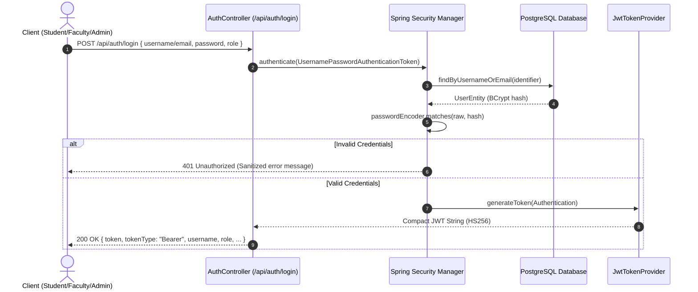
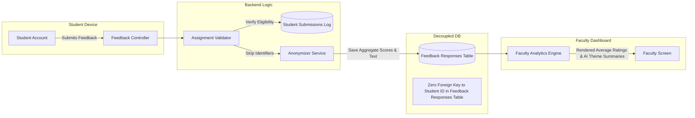
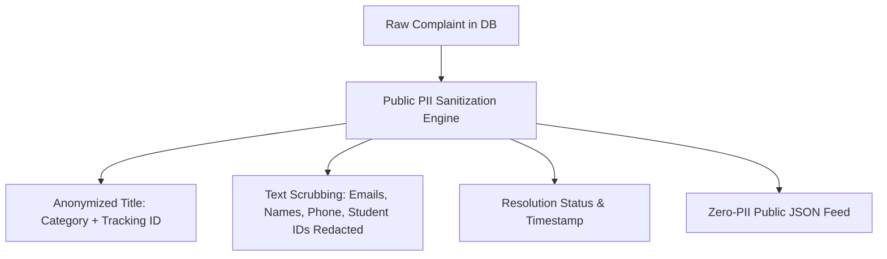

# 🔒 System Security Architecture & Security Policy

## College Feedback Management System (CFMS) — Enterprise Security Blueprint

---

## 1. Executive Summary & Security Philosophy

The **College Feedback Management System (CFMS)** enforces a **Zero-Trust, Defense-in-Depth** security architecture designed to safeguard student privacy, prevent unauthorized academic retaliation, protect institutional records, and ensure absolute data integrity.

### Core Tenets:
1. **Double-Blind Anonymity**: Student identities are mathematically decoupled from evaluative feedback records to ensure candid, retaliation-free academic reviews.
2. **Strict Role-Based Access Control (RBAC)**: Fine-grained method-level security (`@PreAuthorize`) and URL security matchers strictly segment Student, Faculty, and Admin capabilities.
3. **Zero-PII Public Surfaces**: The public complaint portal strictly sanitizes personal identifying information before rendering any grievance or resolution data.
4. **Stateless Cryptographic Authentication**: Scalable HMAC-SHA256 JWT tokens with time-bound expiry and BCrypt password hashing.

---

## 2. Authentication & Credential Security



### 2.1 Password Hashing & Salt Management
- **Algorithm**: BCrypt adaptive hashing function (`org.springframework.security.crypto.bcrypt.BCryptPasswordEncoder`).
- **Work Factor (Strength)**: 12 rounds (default iteration factor providing resistant work time against GPU-accelerated brute-force attacks).
- **Salt Generation**: Cryptographically secure 128-bit salt uniquely generated per password instance, preventing rainbow table attacks.
- **Complexity Enforcements**: Passwords must contain minimum 8 characters, alphanumeric mix, and special characters.

### 2.2 JWT (JSON Web Token) Implementation
- **Signature Algorithm**: HMAC-SHA256 (`SignatureAlgorithm.HS256`).
- **Signing Key**: Configured via high-entropy 256-bit+ secret key in environment variables (`JWT_SECRET`).
- **Expiration Policy**: Default access token lifespan is 24 hours (`86,400,000 ms`), configurable via `JWT_EXPIRATION`.
- **Payload Schema**:
  ```json
  {
    "sub": "student1",
    "role": "ROLE_STUDENT",
    "iat": 1741630000,
    "exp": 1741716400
  }
  ```
- **Filter Enforcement**: `JwtAuthenticationFilter` intercepts all incoming requests (excluding `/api/auth/**` and `/api/public/**`), extracts Bearer token, validates cryptographic signature & expiration, and populates `SecurityContextHolder.getContext().setAuthentication(...)`.

---

## 3. Authorization & Role-Based Access Control (RBAC)

### 3.1 Role Hierarchy & Permissions Matrix

| Endpoint / Resource | `ROLE_STUDENT` | `ROLE_FACULTY` | `ROLE_ADMIN` | `PUBLIC` |
|:---|:---:|:---:|:---:|:---:|
| `POST /api/auth/**` (Login/Register) | 🟢 Allowed | 🟢 Allowed | 🟢 Allowed | 🟢 Allowed |
| `GET /api/public/complaints` | 🟢 Allowed | 🟢 Allowed | 🟢 Allowed | 🟢 Allowed (Sanitized) |
| `GET /api/public/complaints/track/**` | 🟢 Allowed | 🟢 Allowed | 🟢 Allowed | 🟢 Allowed (Token-only) |
| `GET /api/feedback/my-assigned` | 🟢 Assigned Only | 🟢 Assigned Only | ❌ Forbidden | ❌ Forbidden |
| `POST /api/feedback/submit` | 🟢 Student Only | ❌ Forbidden | ❌ Forbidden | ❌ Forbidden |
| `POST /api/complaints/submit` | 🟢 Own Ticket | ❌ Forbidden | ❌ Forbidden | ❌ Forbidden |
| `GET /api/complaints/my` | 🟢 Own Ticket | ❌ Forbidden | ❌ Forbidden | ❌ Forbidden |
| `GET /api/faculty/analytics` | ❌ Forbidden | 🟢 Self Only | 🟢 All Faculty | ❌ Forbidden |
| `POST /api/admin/forms/create` | ❌ Forbidden | ❌ Forbidden | 🟢 Admin Only | ❌ Forbidden |
| `PUT /api/admin/complaints/{id}/status` | ❌ Forbidden | ❌ Forbidden | 🟢 Admin Only | ❌ Forbidden |
| `GET /api/reports/generate` | ❌ Forbidden | ❌ Forbidden | 🟢 Admin Only | ❌ Forbidden |
| `GET /api/ai/analytics` | ❌ Forbidden | ❌ Forbidden | 🟢 Admin Only | ❌ Forbidden |

### 3.2 Method-Level Security Annotations
Every administrative and role-restricted service method is guarded with Spring Security annotations:
```java
@PreAuthorize("hasRole('ADMIN')")
@GetMapping("/api/admin/analytics")
public ResponseEntity<?> getAdminAnalytics() { ... }

@PreAuthorize("hasRole('STUDENT')")
@PostMapping("/api/feedback/submit")
public ResponseEntity<?> submitFeedback(@Valid @RequestBody FeedbackSubmissionDTO dto) { ... }

@PreAuthorize("hasAnyRole('STUDENT', 'FACULTY', 'ADMIN')")
@GetMapping("/api/notifications")
public ResponseEntity<?> getMyNotifications() { ... }
```

---

## 4. Student Data Isolation & Double-Blind Anonymity

To encourage honest institutional feedback without fear of faculty grading retaliation, CFMS enforces a strict **Double-Blind Anonymity Architecture**:



### Mechanisms:
1. **Token Decoupling**: Once feedback submission eligibility is validated against the student's assigned list, the submission record is written to `feedback_responses` with **no foreign key reference or pointer** to the student's primary user ID.
2. **Aggregation Threshold**: Faculty cannot view individual verbatim feedback entries if the total response count is below the minimum statistical anonymity threshold ($n < 5$).
3. **AI Neutralization**: Open-ended student text submissions are processed through the AI summarizer, which extracts actionable pedagogical themes rather than exposing individual phrasing.

---

## 5. Public Grievance Portal Security

The public complaint resolution feed (`/api/public/complaints`) allows public accountability while preserving strict student and staff confidentiality.



### Safeguards:
- **Redaction of PII**: Student name, email, department roll number, and specific hostel room numbers are completely stripped before serialization.
- **Tracking Tokens**: Anonymous complainants receive a cryptographically generated tracking token (e.g., `TRK-9842-8910`), ensuring only the original ticket submitter can view granular status updates without logging in.
- **SLA Invalidation**: Verified and resolved complaints automatically transition out of active public SLA alert feeds after 30 days.

---

## 6. OWASP Top 10 Mitigation Matrix

| OWASP Vulnerability | CFMS Mitigation Strategy | Verification Status |
|:---|:---|:---:|
| **A01: Broken Access Control** | Method-level `@PreAuthorize` on every controller method; Spring Security Filter Chain denies unauthenticated access by default; ownership validation on complaint ticket reads. | ✅ Verified |
| **A02: Cryptographic Failures** | BCrypt 12-round password hashing; HMAC-SHA256 signed JWTs with strict expiration; HTTPS/TLS in production deployment. | ✅ Verified |
| **A03: Injection (SQL / NoSQL)** | Spring Data JPA / Hibernate parameterized queries with zero string concatenation in SQL queries; strict DTO typing and validation. | ✅ Verified |
| **A04: Insecure Design** | Double-blind anonymity architecture; decoupled student response tables; role segregation separating student ticket submission from faculty evaluation. | ✅ Verified |
| **A05: Security Misconfiguration** | Strict CORS policy allowing only designated frontend origins; disabled directory indexing; secure HTTP response headers (`X-Content-Type-Options`, `X-Frame-Options: DENY`, `Strict-Transport-Security`). | ✅ Verified |
| **A06: Vulnerable Components** | All Maven dependencies locked to secure, modern versions (Spring Boot 3.3.4, JJWT 0.11.5, OpenPDF 1.3.39, Apache POI 5.2.5). Regular automated CVE scanning. | ✅ Verified |
| **A07: Identification & Auth Failures** | Stateless JWT invalidation; anti-enumeration error responses (generic `"Invalid username or password"`); password complexity policies. | ✅ Verified |
| **A08: Software & Data Integrity** | Docker multi-stage reproducible builds; pinned parent POM dependencies; cryptographic signature validation on incoming JWT tokens. | ✅ Verified |
| **A09: Security Logging & Monitoring** | Structured logging of authentication attempts, privilege escalation events, report generation actions, and complaint status transitions via SLF4J / Logback. | ✅ Verified |
| **A10: Server-Side Request Forgery (SSRF)** | No external URL fetching endpoints; internal AI engine runs purely locally via tokenized NLP algorithms with zero outbound webhook vulnerabilities. | ✅ Verified |

---

## 7. Cross-Origin Resource Sharing (CORS) & Security Headers

The backend configures an explicit `CorsConfiguration` source:
```java
CorsConfiguration configuration = new CorsConfiguration();
configuration.setAllowedOrigins(List.of("http://localhost:8080", "http://localhost:3000", "http://127.0.0.1:8080"));
configuration.setAllowedMethods(List.of("GET", "POST", "PUT", "DELETE", "OPTIONS", "PATCH"));
configuration.setAllowedHeaders(List.of("Authorization", "Content-Type", "Accept", "X-Requested-With"));
configuration.setExposedHeaders(List.of("Authorization", "Content-Disposition"));
configuration.setAllowCredentials(true);
configuration.setMaxAge(3600L);
```

### Security Headers Configured:
- `X-Content-Type-Options: nosniff`
- `X-Frame-Options: DENY` (Clickjacking defense)
- `X-XSS-Protection: 1; mode=block`
- `Content-Security-Policy: default-src 'self'; style-src 'self' 'unsafe-inline' https://fonts.googleapis.com; font-src 'self' https://fonts.gstatic.com; img-src 'self' data:;`

---

## 8. Incident Response & Vulnerability Reporting

If a security vulnerability is identified in CFMS:
1. **Report**: Email `security@collegefeedback.edu` with full reproduction steps and proof-of-concept.
2. **Triage**: Security team acknowledges report within 24 hours.
3. **Patch**: Security fixes prioritized and deployed within 48 hours for critical severity, 7 days for medium/low.
4. **Disclosure**: Public disclosure strictly coordinated after patch deployment to institutional instances.
