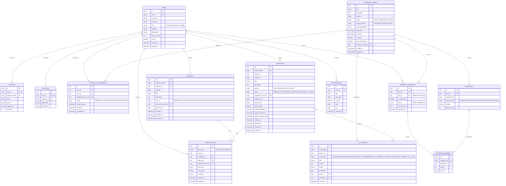

# 📊 Database Schema & Entity Relationship Diagram
## College Student Feedback Management System

```mermaid
erDiagram
    USERS ||--o| STUDENTS : "has profile"
    USERS ||--o| FACULTIES : "has profile"
    USERS ||--o{ FEEDBACK_ASSIGNMENTS : "assigned to"
    USERS ||--o{ FEEDBACK_RESPONSES : "submits"
    USERS ||--o{ COMPLAINTS : "lodges"
    USERS ||--o{ REQUESTS : "submits"
    USERS ||--o{ NOTIFICATIONS : "receives"
    USERS ||--o{ ISSUE_UPDATES : "performs"

    FEEDBACK_FORMS ||--o{ QUESTIONS : "contains"
    FEEDBACK_FORMS ||--o{ FEEDBACK_ASSIGNMENTS : "assigned as"
    FEEDBACK_FORMS ||--o{ FEEDBACK_RESPONSES : "receives"
    FEEDBACK_FORMS ||--o{ AI_INSIGHTS : "analyzed for"

    FEEDBACK_RESPONSES ||--o{ RESPONSE_ANSWERS : "contains"
    QUESTIONS ||--o{ RESPONSE_ANSWERS : "answered by"

    COMPLAINTS ||--o{ ISSUE_UPDATES : "logs"
    COMPLAINTS ||--o{ AI_INSIGHTS : "triggers"
    REQUESTS ||--o{ ISSUE_UPDATES : "logs"

    USERS {
        uuid id PK
        string email UK
        string password
        string full_name
        string role "STUDENT | FACULTY | ADMIN"
        string identifier
        string department
        int year_of_study
        boolean active
        timestamp created_at
        timestamp updated_at
    }

    STUDENTS {
        uuid id PK
        uuid user_id FK,UK
        string register_number UK
        string batch
        string course
        string department
        int semester
    }

    FACULTIES {
        uuid id PK
        uuid user_id FK,UK
        string employee_id UK
        string department
        string designation
    }

    FEEDBACK_FORMS {
        uuid id PK
        string title
        text description
        string category
        string status "DRAFT | PUBLISHED | CLOSED"
        string target_audience "STUDENTS | FACULTY | BOTH"
        string target_department
        timestamp start_date
        timestamp end_date
        boolean is_active
        boolean allow_anonymous
        uuid created_by_user_id FK
        timestamp created_at
        timestamp updated_at
    }

    QUESTIONS {
        uuid id PK
        uuid form_id FK
        string question_text
        string question_type "RATING | TEXT | MULTIPLE_CHOICE | YES_NO | STAR_RATING"
        boolean required
        int display_order
    }

    FEEDBACK_ASSIGNMENTS {
        uuid id PK
        uuid form_id FK
        uuid user_id FK
        uuid assigned_by_user_id FK
        string status "PENDING | IN_PROGRESS | COMPLETED | EXPIRED"
        timestamp assigned_date
        timestamp deadline
        timestamp completed_at
    }

    FEEDBACK_RESPONSES {
        uuid id PK
        uuid form_id FK
        uuid user_id FK "Nullable if anonymous"
        boolean is_anonymous
        string status "DRAFT | SUBMITTED"
        float overall_rating
        timestamp submitted_at
    }

    RESPONSE_ANSWERS {
        uuid id PK
        uuid response_id FK
        uuid question_id FK
        int rating
        string answer
    }

    COMPLAINTS {
        uuid id PK
        string ticket_number UK
        uuid student_id FK
        string category
        string title
        text description
        string priority "LOW | MEDIUM | HIGH | CRITICAL"
        string status "PENDING | IN_PROGRESS | ESCALATED | RESOLVED | CLOSED"
        uuid assigned_to_user_id FK
        string assigned_cell
        string admin_note
        boolean public_visible
        timestamp public_published_at
        timestamp public_removed_at
        timestamp target_resolution_time
        timestamp created_at
        timestamp updated_at
        timestamp resolved_at
        timestamp verified_at
    }

    REQUESTS {
        uuid id PK
        string request_number UK
        uuid student_id FK
        string category
        string title
        text description
        string status "PENDING | IN_PROGRESS | IN_REVIEW | APPROVED | REJECTED | COMPLETED | RESOLVED"
        uuid assigned_to_user_id FK
        string admin_note
        timestamp created_at
        timestamp updated_at
        timestamp resolved_at
    }

    ISSUE_UPDATES {
        uuid id PK
        string issue_type "COMPLAINT | REQUEST"
        uuid issue_id
        uuid complaint_id FK
        uuid request_id FK
        uuid updated_by_user_id FK
        string old_status
        string new_status
        string comment
        timestamp created_at
        timestamp updated_at
    }

    NOTIFICATIONS {
        uuid id PK
        uuid user_id FK
        string title
        string message
        boolean is_read
        string type
        string link
        timestamp created_at
    }

    AI_INSIGHTS {
        uuid id PK
        string source_type
        uuid source_id
        string insight_type "SENTIMENT | RECURRING_ISSUE | PRIORITY | RECOMMENDATION | SUMMARY | CATEGORY | TREND | BOTTLENECK | SLA_ALERT"
        string title
        text content
        string priority
        float confidence
        uuid form_id FK
        uuid complaint_id FK
        timestamp created_at
    }
```
